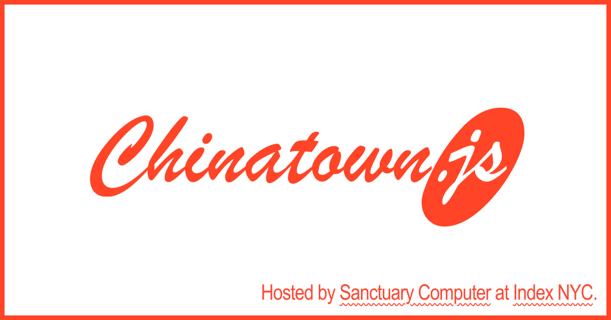

# Chinatown.JS

## A meetup in NYC's Chinatown for the Javascript community, hosted by [Sanctuary Computer](https://www.sanctuary.computer/) at [Index NYC](https://www.index-space.org/irl/nyc).

(Heavily inspired by the legendary [BrooklynJS](https://github.com/brooklynjs/brooklynjs.github.io), RIP)

Chinatown JS features three or four 10-minute talks by Javascript developers on both technical and non-technical topics. Submit a talk if you’d like to be featured at our next event.

Tickets cost $10 so we can cover food and drink on the night. Follow [@sanctucompu](https://twitter.com/sanctucompu) on Twitter where we'll announce when tickets go live (and other such logistics).

## Submit a talk

Talks are proposed via issues; just [open a new issue](https://github.com/sanctuarycomputer/chinatown.js/issues/new?assignees=&labels=talk+submission&projects=&template=talk-submission.md&title=%5BTalk%5D+Your+Talk%27s+Title) and fill out the template fields. Talks are chosen internally by Sanctuary Computer developers (although we might open this up to the community in the future if that's easy enough).

## Got questions?

First, check the FAQs on our website. If they don't answer your questions, shoot us an email at [ctjs@sanctuary.computer](mailto:ctjs@sanctuary.computer) and we'll get back to you.

## Sponsor Chinatown.js

If you'd like to co-sponsor Chinatown.js, you can either [Sponsor us on Github](https://github.com/sponsors/sanctuarycomputer) and we'll list your name below, or email us at [ctjs@sanctuary.computer](mailto:ctjs@sanctuary.computer).